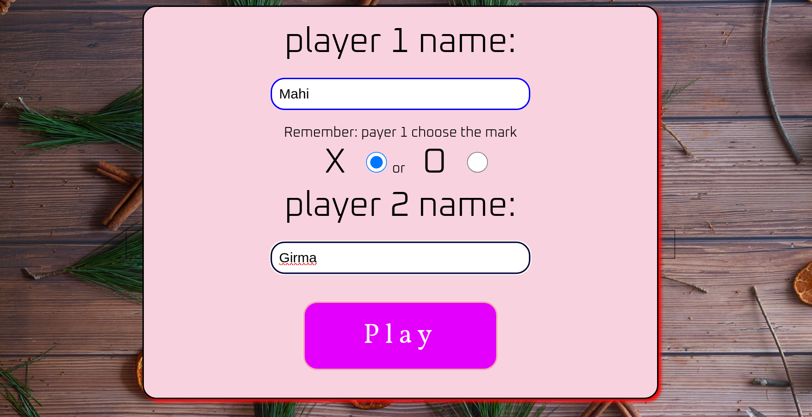
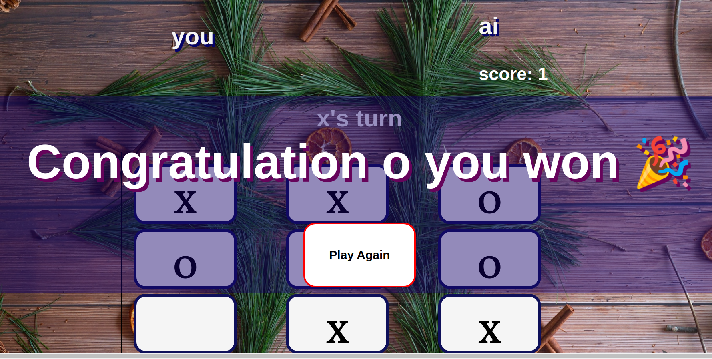

# Tic-Tac-Toe-Game
This project was solution for the odin project to learn about factory function and modulae pattern to organize code .
[https://www.theodinproject.com/lessons/node-path-javascript-tic-tac-toe]
# Built with
-Html
-css
-javascript
-recursion for minimax algorithm
# screenshot

# live preview
[https://girma3.github.io/Tic-Tac-Toe-Game/]
# what I learned
-to separate function to make it clear
-about closure and scope
-the advantage of of using factory function and module  over constructors
-logic of each function where to put
-little bit about recursion 
-minimax algorithm for ai to find best choice
# struggled
I struggle first where to put each functions  and I was  new to factory function and module pattern too so that was the hard part to reveal function to public and which one to keep private and finding best move for ai was great learning curve.
### Continued development
to make my code clean and readable and want learn more about recursion.
# helpful materials
*for where to put function and building the game logic
   https://www.ayweb.dev/blog/building-a-house-from-the-inside-out
 *for minimax algorithm
  https://www.youtube.com/watch?v=ovr2sTYhb1I&ab_channel=CodeExplained